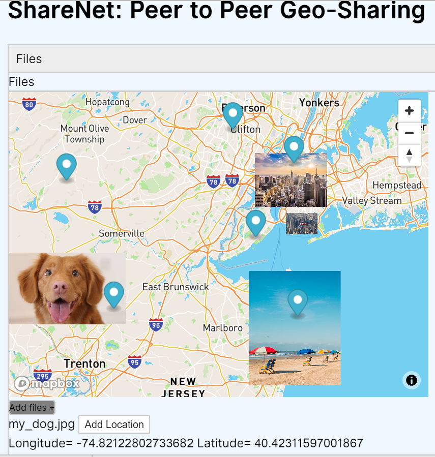

# ShareNet
Peer to Peer Geo Sharing web application
This application was developed by Levente Szabo and Sandra Flechas 

ShareNet is a P2P Geo Sharing web application developed in Javascript and HTML, it makes
use of the dat:// p2p protocol provided by the beakerbrowser. 

Anyone can visit the page at 

dat://netpage.hashbase.io/    or 

dat://24369b22719087781dfb8dd5148813d76749f4cf4f6963c54b2ee713783caa8a/

if the page is not being seeded.

Alternatively one can make a new page using the beakerbrowser and sync the website files with this repo. The 
beakerbrowser allows one to interact with the application and make a customizable copy if they
wish. This repository serves as a collection of the ShareNet Demo source code.

For Questions please email: ls5122@nyu.edu

